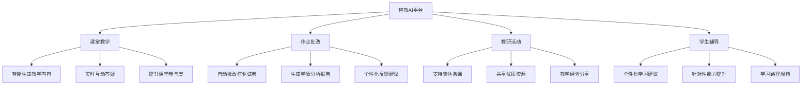

# 🤖 智教AI - 中小学教研教学辅助大模型

<div align="center">


[](https://github.com/username/zhijiao-ai)
[](LICENSE)
[](CHANGELOG.md)
[](https://github.com/username/zhijiao-ai/actions)

**🎯 引领中小学教研教学辅助大模型的创新者**

*基于知名师范大学深厚的教育底蕴，融合前沿人工智能技术，打造专为中小学教研教学服务的智能化大模型平台*

[🚀 快速开始](#快速开始) • [📖 文档](#文档) • [🎨 演示](#演示) • [🤝 贡献](#贡献) • [📧 联系我们](#联系我们)

</div>

---

## 🌟 项目概述

智教AI是一个专为中小学教育场景设计的人工智能大模型平台，致力于通过先进的AI技术为教师提供全方位的教研教学支持，让每一位教师都能享受AI赋能的教学新体验。

### ✨ 核心特色

- 🧠 **个性化教学设计** - 智能生成教案，推荐最适合的教学策略
- 📊 **智能评估系统** - 自动批改作业，生成详细学情分析
- 🎯 **课堂互动增强** - 实时答疑，提升课堂参与度
- 📚 **教研数据分析** - 基于海量数据提供科学教学建议

---

## 🎯 功能亮点

### 🔥 四大核心功能模块

<table>
<tr>
<td width="50%">

#### 🎨 个性化教学设计与资源检索
- ✅ 智能生成个性化教案
- ✅ 自动推荐教学策略和资源  
- ✅ 显著提升备课效率
- ✅ 基于学生特点定制内容

</td>
<td width="50%">

#### 📈 智能评估与题目生成
- ✅ 自动生成学情分析报告
- ✅ 智能出题和批改作业
- ✅ 精准教学反馈
- ✅ 个性化学习成长支持

</td>
</tr>
<tr>
<td width="50%">

#### 🎪 教学展示与课堂辅助
- ✅ 自动生成说课稿和PPT
- ✅ 实时转写课堂笔记
- ✅ 人机智能互动答疑
- ✅ 全面提升课堂体验

</td>
<td width="50%">

#### 🔬 教研数据智能分析
- ✅ 收集分析专业教研数据
- ✅ 科学的教学决策依据
- ✅ 精准的教研指导方案
- ✅ 依托权威教育平台

</td>
</tr>
</table>

---

## 📊 项目成果

<div align="center">

| 🏫 学校落地 | 👩‍🏫 教师用户 | 🔬 专利技术 | 😊 用户满意度 |
|:---:|:---:|:---:|:---:|
| **80+所** | **8000+名** | **15项** | **98%** |

| 📚 课堂互动提升 | ⏰ 备课时间节省 | 🎯 教案检索准确率 | 📈 成绩提升效果 |
|:---:|:---:|:---:|:---:|
| **85%** | **50%** | **98.7%** | **显著提升** |

</div>

---

## 🛠️ 技术架构

### 💻 前端技术栈

```javascript
// 现代化前端框架
const techStack = {
  ui: ["HTML5", "CSS3", "JavaScript ES6+"],
  animations: ["AOS.js", "Animate.CSS"],
  icons: ["Font Awesome 6.4.0"],
  fonts: ["Google Fonts - Inter"],
  effects: ["3D Transforms", "Parallax Scrolling", "Glassmorphism"]
}
```

### 🧠 核心技术特性

- **🎨 现代化设计系统** - 玻璃拟态设计 + 科技蓝配色
- **⚡ 高性能动画** - 60fps流畅动画体验
- **📱 响应式布局** - 完美适配各种设备
- **🔄 智能交互** - 3D鼠标跟随 + 视差滚动
- **♿ 无障碍支持** - 键盘导航 + 屏幕阅读器友好

---

## 🚀 快速开始

### 📋 环境要求

- 现代浏览器 (Chrome 90+, Firefox 88+, Safari 14+)
- HTTP服务器 (可选，用于本地开发)

### 🔧 安装步骤

1. **克隆项目**
   ```bash
   git clone https://github.com/username/zhijiao-ai.git
   cd zhijiao-ai
   ```

2. **启动服务**
   ```bash
   # 使用Python启动本地服务器
   python -m http.server 8000
   
   # 或使用Node.js
   npx serve .
   
   # 或使用Live Server (VS Code插件)
   ```

3. **访问应用**
   ```
   打开浏览器访问: http://localhost:8000
   ```

### 🎯 目录结构

```
zhijiao-ai/
├── 📄 index.html          # 主页面文件
├── 📁 assets/            # 静态资源
│   ├── 🎨 css/          # 样式文件
│   ├── 📜 js/           # JavaScript文件
│   └── 🖼️ images/        # 图片资源
├── 📋 README.md          # 项目说明
└── 📜 LICENSE           # 开源协议
```

---

## 🎨 演示

### 🌟 在线演示

[](https://zhijiao-ai-demo.com)

### 📱 截图预览

<div align="center">

| 🏠 首页展示 | 🔧 功能介绍 |
|:---:|:---:|
|  |  |

| 📊 数据展示 | 👥 团队介绍 |
|:---:|:---:|
|  |  |

</div>

### 🎬 功能演示视频

[](https://youtube.com/watch?v=demo)

---

## 🏗️ 应用场景

<div align="center">



</div>

---

## 👥 团队介绍

### 🌟 核心成员

<table>
<tr>
<td align="center" width="33%">

<br><strong>余柏书</strong>
<br><em>项目负责人</em>
<br>资深教育技术专家
</td>
<td align="center" width="33%">

<br><strong>AI技术团队</strong>
<br><em>算法工程师</em>
<br>产品开发团队
</td>
<td align="center" width="33%">

<br><strong>教育专家顾问</strong>
<br><em>一线教师</em>
<br>教研专家团队
</td>
</tr>
</table>

---

## 📖 文档

### 📚 详细文档

- 📋 [项目介绍](docs/introduction.md)
- 🔧 [安装指南](docs/installation.md)
- 🎯 [使用教程](docs/tutorial.md)
- 🔌 [API文档](docs/api.md)
- 🎨 [设计规范](docs/design-guide.md)
- ❓ [常见问题](docs/faq.md)

### 🏗️ 开发指南

- 🛠️ [开发环境搭建](docs/development.md)
- 🎨 [前端开发规范](docs/frontend-guide.md)
- 🧪 [测试指南](docs/testing.md)
- 📦 [部署指南](docs/deployment.md)

---

## 🤝 贡献

我们热烈欢迎社区贡献！无论是bug修复、功能增强还是文档改进，您的参与都是宝贵的。

### 🎯 贡献方式

1. **🍴 Fork 项目**
2. **🌿 创建特性分支** (`git checkout -b feature/AmazingFeature`)
3. **💾 提交更改** (`git commit -m 'Add some AmazingFeature'`)
4. **📤 推送分支** (`git push origin feature/AmazingFeature`)
5. **🔄 创建 Pull Request**

### 📝 贡献指南

- 📋 [贡献指南](CONTRIBUTING.md)
- 🎯 [行为准则](CODE_OF_CONDUCT.md)
- 🐛 [问题反馈](https://github.com/username/zhijiao-ai/issues)
- 💡 [功能建议](https://github.com/username/zhijiao-ai/discussions)

### 🌟 贡献者

<a href="https://github.com/username/zhijiao-ai/graphs/contributors">
  
</a>

---

## 📄 许可证

本项目采用 MIT 许可证 - 详情请参阅 [LICENSE](LICENSE) 文件。

```
MIT License

Copyright (c) 2024 智教AI团队

Permission is hereby granted, free of charge, to any person obtaining a copy
of this software and associated documentation files (the "Software"), to deal
in the Software without restriction...
```

---

## 📧 联系我们

<div align="center">

### 🤝 携手共创教育未来

我们期待与您的合作，共同推动教育智能化发展！

[](mailto:zhijiao@ai-edu.com)
[](tel:400-XXX-XXXX)
[](https://maps.google.com)

[](https://github.com/username/zhijiao-ai)
[](https://zhijiao-ai.com)

</div>

---

## 🎉 致谢

感谢所有为智教AI项目贡献力量的个人和组织：

- 🏫 **知名师范大学** - 提供深厚的教育理论基础
- 👩‍🏫 **一线教师团队** - 提供实践经验和需求反馈  
- 💻 **开源社区** - 提供优秀的开源工具和框架
- 🎓 **教育专家** - 提供专业的教育指导
- 🤝 **合作伙伴** - 支持项目的推广和应用

---

<div align="center">

### 🌟 如果这个项目对您有帮助，请给我们一个 Star！

[](https://star-history.com/#username/zhijiao-ai&Date)

**💡 让AI点亮教育未来 | Made with ❤️ by 智教AI团队**

</div>

---

## 🔮 未来规划

### 🚀 Version 2.0 规划

- [ ] 🌍 多语言支持
- [ ] 📱 移动端原生应用
- [ ] 🎯 更多学科支持
- [ ] 🤖 语音交互功能
- [ ] 📊 高级数据分析
- [ ] 🔗 第三方平台集成

### 🎯 长期愿景

- **📚 知识图谱构建** - 建立完整的教育知识体系
- **🌐 全球化部署** - 服务全球教育工作者
- **🤝 生态系统建设** - 构建开放的教育AI生态
- **🔬 持续技术创新** - 引领教育AI技术发展

---

**🎓 智教AI - 让每一位教师都能享受AI赋能的教学新体验！**
